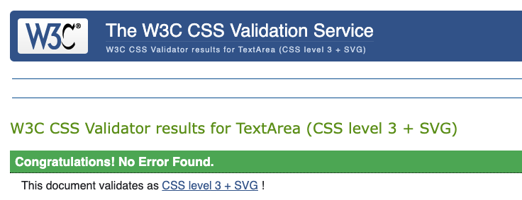

# <ins>*ClassFit*</ins> - booking system

## <ins>About ClassFit</ins>
ClassFit is an online booking system for a local gym that allows the coaches to create classes/event and allows the users to book on to these and log their results/scores.

This project will be used as my capstone project for the Code Institute skills bootcamp. It will be a full stack python django application.

The target user for this project will be a gym owner who runs a gym like the CrossFit gym I attend. This is where they have regular classes and times and these can be managed by the owner and their clients can reserve spaces and log progress.

<ins>Deployed site link: </ins>[ClassFit](https://classfit-9bcca60104a7.herokuapp.com/)

## <ins>Contents</ins>

- [Project planning](#project-planning)
- [Technologies used](#technoglogies-used)
- [Testing](#testing)
- [Impact of AI Analysis](#impact-of-ai-analysis)
- [Evaluation](#evaluation)

## Project Planning

### User Stories

This project was developed using an agile methodology. To include this in the project I created a project board with relevant user stories.
These user stories were created to demonstrate who the main user of each feature is, what the feature will do and why this is beneficial and is followed by an acceptance criteria.

### include user stories

### URL planning

For this project the URL and navigation planning was essential as this could cause many issues during development if it was not thought out and followed a logical flow. So for each app they would have their own urls file.

'' - used to display the log in/ sign up page

<ins>**Booking app:**</ins>

- 'booking/*datestring*' - used to display the available classes on a given date
- 'booking/*datestring*/*eventid*' - used to display the event details of the selected event

- <ins>*additional*</ins> 'booking/*datestring*/add' - used by only selected users to add classes on a specific date

<ins>**Log Book app:**</ins>

- 'logbook/' - used to go to the main logbook page that displays scores and new score form
- 'logbook/update/' - used to display form to enter an edited score

<ins>**Home app:**</ins>

'home/' - used to display the home page after log in then using the nav bar and buttons on the home page view the other apps

## Technoglogies Used

The site was deployed using **heroku web servcies** and used **GitHub** for version control.

ClassFit was developed using the python framework **Django** on the backend working with a **Postgres database**. For the frontend I made use of **HTML**, **CSS**, **Javacript** and I also used the **bootstrap framework** to improve development speed and allow the project to be responsive. Another key factor in speeding up the devlopment was the use of AI. The main AI tools used where ChatGPT and Github Copilot. I will go into further detail about the impact of these tools [here.](#impact-of-ai-analysis)

## Testing

### HTML Validation
All the pages passed with the following message:

### CSS Validation 

## Impact of AI Analysis

The main tools used:

 - ChatGPT
 - Github Copilot

 ### What these tools added to the project

 ChatGPT was great for me to brainstorm ideas. It could feedback to me the positives and negatives of an idea such as the structure of a model for the database. In this example it might say that using an integer for the Id was a good idea but gave me the correct naming convention to use djangos autoincrementing Id feature. This cut development time for because I didn't have to code this myself but also it was able to tell me features I had forgotten or didn't even know existed.

 Furthermore, Copilot was able to help me debug code. Where I haven't got the syntax memorised or I'm missing a small detail copilot was great for jumping in and correcting these mistakes.

 ### What were the downsides

 The greatest risk when using Copilot was from my own use of the tool. It was important to make sure you can understand the changes copilot has made. With this in mind I found that I didn't run into many issues as I refused to add any code in that I wasn't sure of but with that said I made a mistake with ChatGPT that did use up some development time.

 When using ChatGPT it gave me some code snippets for an idea that I had been talking through for the events/classes booking system. For my project I used different variable names and this caused confusion and I had to go through and change them.

 Another frustrating part was when passing the date from django to javascript it initially struggled to change the date format to the required format.

 ## Evaluation